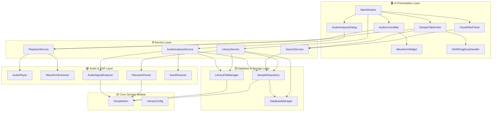

# Application Design: Component Dependencies & Data Flow (component-dependency.md)

## 1. Component Architecture & Dependency Diagram

### Mermaid Architecture Diagram


### Text Alternative Architecture
```
[UI Presentation Layer]
 MainWindow ──► FacetFilterPanel, SampleTableView, AudioControlBar, WaveformWidget, AudioAnalysisDialog, DAWDragDropHandler
      │
      ▼ (Calls Service Layer)
[Service Layer]
 LibraryService       ──► FilenameParser, LibraryFileManager, SampleRepository, DatabaseManager
 SearchService        ──► SampleRepository
 AudioAnalysisService ──► AudioSignalAnalyzer, AutoRenamer, LibraryFileManager, SampleRepository
 PlaybackService      ──► AudioPlayer, WaveformExtractor
      │
      ▼ (Calls Core / Data / DSP Layer)
[Database & Storage]  SampleRepository, DatabaseManager (SQLite WAL), LibraryFileManager
[Audio & DSP]         AudioPlayer, WaveformExtractor, FilenameParser, AudioSignalAnalyzer, AutoRenamer
[Core Domain]         SampleItem, LibraryConfig
```

---

## 2. Component Dependency Matrix

| Component | Depends On | Used By |
|---|---|---|
| **`SampleItem`** | None (Pure Python dataclass) | All layers |
| **`LibraryConfig`** | None (JSON serialization) | DatabaseManager, MainWindow |
| **`DatabaseManager`** | `sqlite3`, `LibraryConfig` | `SampleRepository`, `LibraryService` |
| **`SampleRepository`** | `DatabaseManager`, `SampleItem` | `LibraryService`, `SearchService`, `AudioAnalysisService` |
| **`LibraryFileManager`** | `os`, `shutil`, `pathlib`, `SampleItem` | `LibraryService`, `AudioAnalysisService` |
| **`FilenameParser`** | `re`, `SampleItem` | `LibraryService` |
| **`AudioSignalAnalyzer`** | `numpy`, `scipy`, `wave`/`soundfile` | `AudioAnalysisService` |
| **`AutoRenamer`** | `pathlib`, `SampleItem` | `AudioAnalysisService` |
| **`AudioPlayer`** | `PyQt6.QtMultimedia` / audio backend | `PlaybackService` |
| **`WaveformExtractor`** | `numpy`, audio decode | `PlaybackService` |
| **`LibraryService`** | `FilenameParser`, `LibraryFileManager`, `SampleRepository`, `DatabaseManager` | `MainWindow` |
| **`SearchService`** | `SampleRepository` | `FacetFilterPanel`, `MainWindow` |
| **`AudioAnalysisService`**| `AudioSignalAnalyzer`, `AutoRenamer`, `LibraryFileManager`, `SampleRepository` | `AudioAnalysisDialog`, `MainWindow` |
| **`PlaybackService`** | `AudioPlayer`, `WaveformExtractor` | `AudioControlBar`, `MainWindow`, `SampleTableView` |
| **`DAWDragDropHandler`**| `PyQt6.QtGui.QDrag`, `PyQt6.QtCore.QMimeData` | `SampleTableView` |

---

## 3. Communication Patterns

1. **Service Calls (Direct / Synchronous)**:
   - UIコントローラーから各Serviceへ直接メソッド呼び出しを行い、結果を取得してUIモデルを更新。
2. **DAW Drag & Drop Event (OS Native Integration)**:
   - `SampleTableView.mouseMoveEvent` にてドラッグ距離を検知。
   - `DAWDragDropHandler` が `QDrag` を生成し、`QMimeData` に `file://` URI（`text/uri-list`）を付与してOSネイティブD&Dを開始。Cakewalk/Sonar等の外部プロセスへファイル参照を安全に引き渡し。
3. **Audio Playback Synchronization**:
   - `PlaybackService` がタイマーイベントまたは再生位置更新シグナルを受信し、`WaveformWidget` の再生バー位置をリアルタイム更新。
4. **Batch DSP Analysis & Progress Reporting**:
   - `AudioAnalysisService` がバッチ処理を実行する際、進捗コールバック（`progress_callback(current, total)`）を介して `AudioAnalysisDialog` のQProgressBarを更新。
