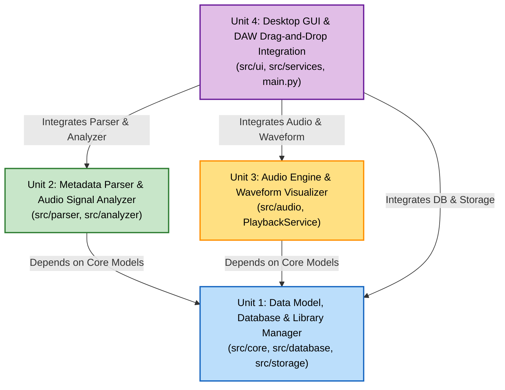

# Unit of Work Dependencies (unit-of-work-dependency.md)

## 1. Unit Dependency Graph

### Mermaid Dependency Diagram


### Text Alternative Diagram
```
Unit 1 (Data Model, Database & Library Manager)
  ▲                        ▲
  │ (Core Models)          │ (Core Models)
Unit 2 (Parser & DSP)    Unit 3 (Audio & Waveform)
  ▲                        ▲
  │                        │
  └──────────┬─────────────┘
             │ (Integrates All)
Unit 4 (Desktop GUI & DAW Integration)
```

---

## 2. Unit Dependency Matrix

| Unit | Depends On | Depended On By | Implementation Sequence |
|---|---|---|---|
| **Unit 1: Data & Library** | None (Standard Library, SQLite) | Unit 2, Unit 3, Unit 4 | **1st** (Foundation) |
| **Unit 2: Parser & DSP** | Unit 1 (`SampleItem`, `LibraryConfig`) | Unit 4 | **2nd** |
| **Unit 3: Audio & Waveform**| Unit 1 (`SampleItem`) | Unit 4 | **3rd** |
| **Unit 4: GUI & DAW Integration** | Unit 1, Unit 2, Unit 3 | None (Application Root) | **4th** (Integration) |

---

## 3. Development & Construction Sequence Rationale

1. **Step 1 (Unit 1: Data & Library)**:
   - 永続化スキーマ、モデル、および物理フォルダ管理を最初に確立することで、以降の全ユニットが共通データ構造（`SampleItem`）を利用できるようにします。
2. **Step 2 (Unit 2: Parser & DSP)**:
   - ファイル名解析ルールおよびBPM/Key推定DSPエンジンを独立して構築し、HypothesisによるPBT（プロパティベーステスト）でパーサーと正規化の品質を徹底検証します。
3. **Step 3 (Unit 3: Audio & Waveform)**:
   - 再生エンジンと波形ピーク生成を実装し、低遅延再生と破損ファイル隔離（RESILIENCY-10）を単体でテスト・検証します。
4. **Step 4 (Unit 4: GUI & DAW Integration)**:
   - 各サービスおよびPyQt6ウィジェット、Cakewalk/Sonarへのネイティブドラッグ＆ドロップ、音声解析ダイアログを統合し、完成させます。
