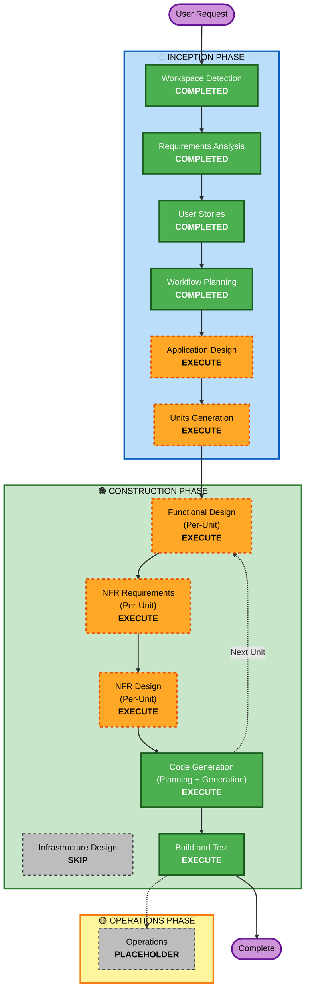

# Execution Plan: Sound Sample Manager (音源管理ソフト)

## Detailed Analysis Summary

### Project Overview & Scope
- **Project Type**: Greenfield (新規デスクトップアプリケーション開発)
- **Application Nature**: Python + PyQt6 によるローカル音源管理・プレビュー・DAWドラッグ＆ドロップ連携ツール
- **Scope & Components**:
  1. **Data Model & SQLite Database**: 音源メタデータテーブル、インデックス、WALモード、自動バックアップ
  2. **Library File Manager**: `Library/Type/Genre/Instrument/...` 構造化フォルダ管理、インポート、同期、「Other」隔離
  3. **Metadata Parser & Auto-Tagger**: ファイル名正規表現パターン解析、WAV/ID3タグ解析、「Other」フォールバック
  4. **Audio Signal Analyzer & Auto-Renamer**: 未知音源のBPM（テンポ）検出、キー（調性）推定、命名規則に沿ったファイル名自動リネーム
  5. **Low-Latency Audio Player & Waveform Renderer**: 低遅延プレビュー、波形描画、自動再生（Auto-Play）、ループ再生（Loop Playback）
  6. **DAW Drag & Drop & GUI Application**: Cakewalk / Sonar 等のDAWトラックへの直接ドロップ、ファセットフィルター、検索バー、テーブルビュー

### Change Impact Assessment
- **User-facing changes**: Yes — フルデスクトップGUI画面、波形ビジュアライザー、DAWドラッグ＆ドロップ操作、解析リネームダイアログ
- **Structural changes**: Yes — モジュール化されたクリーンアーキテクチャ（Core, Audio, Database, Parser, Analyzer, UI）
- **Data model changes**: Yes — 音源サンプルエンティティおよびSQLiteスキーマの新規構築
- **API/Contract changes**: N/A (ローカルデスクトップアプリ)
- **NFR impact**: Yes — 低遅延再生（<50ms）、高速検索（<10ms）、壊れた音声ファイルへの耐障害性（RESILIENCY-10）、DB保護（RESILIENCY-12）、パーサー/正規化関数のPBT（Hypothesis）

### Risk Assessment
- **Risk Level**: Low to Moderate (ローカル単一プロセスアプリのためリスクは限定的だが、DAWへのネイティブD&Dおよびオーディオ信号処理・再生エンジンの安定性が品質の要)
- **Rollback Complexity**: Easy (Gitリポジトリ管理およびローカルDBバックアップ世代管理)
- **Testing Complexity**: Moderate (HypothesisによるPBT、ユニットテスト、DAW連携およびオーディオ再生の検証)

---

## Workflow Visualization

### Mermaid Diagram


### Text Alternative
```
Phase 1: INCEPTION PHASE
- Stage 1: Workspace Detection (COMPLETED)
- Stage 2: Requirements Analysis (COMPLETED)
- Stage 3: User Stories (COMPLETED)
- Stage 4: Workflow Planning (COMPLETED)
- Stage 5: Application Design (EXECUTE - コンポーネント設計・サービス層定義)
- Stage 6: Units Generation (EXECUTE - 4つの開発ユニットへの分割・依存定義)

Phase 2: CONSTRUCTION PHASE (Per-Unit Loop: Unit 1 -> Unit 2 -> Unit 3 -> Unit 4)
- Functional Design (EXECUTE - スキーマ、アルゴリズム、PBTプロパティ定義)
- NFR Requirements (EXECUTE - ライブラリ選定、パフォーマンス、Hypothesis設定)
- NFR Design (EXECUTE - 耐障害性・例外隔離・DBバックアップ設計)
- Infrastructure Design (SKIP - クラウドインフラなし、ローカルデスクトップアプリのため)
- Code Generation (EXECUTE - 実装計画とコード・テスト生成)
- Build and Test (EXECUTE - 総合ビルド検証・PBT/ユニットテスト実行・動作確認)

Phase 3: OPERATIONS PHASE
- Operations (PLACEHOLDER)
```

---

## Phases to Execute & Rationale

### 🔵 INCEPTION PHASE
- [x] **Workspace Detection** (COMPLETED)
- [x] **Requirements Analysis** (COMPLETED)
- [x] **User Stories** (COMPLETED)
- [x] **Workflow Planning** (COMPLETED)
- [ ] **Application Design** - **EXECUTE**
  - *Rationale:* 各コンポーネント（Database, File Manager, Metadata Parser, Audio Analyzer, Audio Player, PyQt6 UI）の責務、クラス構造、サービス層の相互作用を明確化するため。
- [ ] **Units Generation** - **EXECUTE**
  - *Rationale:* 独立して実装・テスト可能な4つのUnit of Work（DB/ファイル管理、パーサー/解析エンジン、オーディオ/波形、GUIアプリ）に分割するため。

### 🟢 CONSTRUCTION PHASE (Per-Unit)
- [ ] **Functional Design** - **EXECUTE**
  - *Rationale:* 各ユニットのデータ構造、アルゴリズム、DAW D&D用MIMEデータフォーマット、Hypothesisプロパティ（PBT-01）の定義。
- [ ] **NFR Requirements** - **EXECUTE**
  - *Rationale:* 各ユニットのパフォーマンス要件（<50ms再生レイテンシー、<10ms検索）と依存パッケージ（PyQt6, sounddevice/PyQt6.QtMultimedia, numpy/scipy, hypothesis）の確定。
- [ ] **NFR Design** - **EXECUTE**
  - *Rationale:* 破損ファイル耐性（RESILIENCY-10）、SQLite WALモード、自動バックアップ（RESILIENCY-12）の具現化。
- [ ] **Infrastructure Design** - **SKIP**
  - *Rationale:* ローカルデスクトップアプリであり、AWS等のクラウドインフラリソースが存在しないため。
- [ ] **Code Generation** - **EXECUTE (ALWAYS)**
  - *Rationale:* ユニットごとのステップ別コード生成計画（Part 1）およびコード・テスト生成（Part 2）。
- [ ] **Build and Test** - **EXECUTE (ALWAYS)**
  - *Rationale:* 全ユニットの統合テスト、Hypothesisプロパティテストの実行、動作検証。

### 🟡 OPERATIONS PHASE
- [ ] **Operations** - **PLACEHOLDER**
  - *Rationale:* 今後のインストーラー作成やパッケージング等の拡張用プレースホルダー。

---

## Proposed Units of Work (開発ユニット構成)

1. **Unit 1: Data Model, Database & Library Manager**
   - 音源エンティティ、SQLite DB（WAL・整合性チェック・バックアップ）、`Library/` フォルダ自動整理・同期・「Other」隔離機能。
2. **Unit 2: Metadata Parser & Audio Signal Analyzer**
   - ファイル名パターン正規表現パーサー、Key/BPM正規化、音声波形からのBPM/Key自動検出エンジン、命名規則自動リネーム。
3. **Unit 3: Audio Engine & Waveform Visualizer**
   - 低レイテンシーオーディオプレイヤー、Auto-Play、Loop Playback、波形データ抽出・描画コンポーネント。
4. **Unit 4: Desktop GUI & DAW Drag-and-Drop Integration**
   - PyQt6 メインウィンドウ、ファセットフィルターパネル、検索バー、音源テーブル、Cakewalk/SonarへのネイティブD&D、音声解析リネームダイアログ。

---

## Success Criteria
- [x] Cakewalk by BandLab / Sonar 等のDAWに音源を直接ドラッグ＆ドロップして貼り付け可能
- [x] Type, 楽器, ジャンル, BPM, キー, 制作者による瞬時の絞り込み・検索
- [x] 波形表示、自動再生、ループ再生による快適なプレビュー試聴
- [x] ファイル名からのメタデータ自動抽出および未判定時の「Other」分類
- [x] プロパティ不明音源の定量音声解析（BPM/Key検出）および命名規則自動リネーム
- [x] `SoundLibrary/` による持続可能な管理フォルダ構成とSQLiteデータベース保護
- [x] HypothesisによるPBTおよびユニットテストが全て合格
